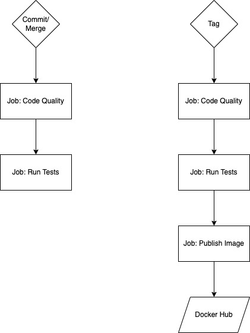

[](https://codecov.io/gh/max-pfeiffer/password-generator)
# password-generator
A FastApi example project providing a password generator.

## Local Development
Requirements:
* Python v3.9
* pip

### Create virtual environment and install dependencies
```shell
python -m venv .venv
source .venv/bin/activate
pip install -r requirements.txt
pip install -r requirements-dev.txt
```

### Environment Variables and .env File
For running the application locally with a custom configuration using Uvicorn
(also when using docker-compose) you need to have a ```.env``` file placed in
project root. This file is not checked into the repo. This .env file contains
the following environment variables for configuring the default values for the
password generation: 
* DEFAULT_PASSWORD_LENGTH: configures the default password length
* PASSWORD_NUMBERS: flag, "1" if the password should contain numbers
* PASSWORD_LOWER_CASE_CHARS: flag, "1" if the password should contain lower case chars
* PASSWORD_UPPER_CASE_CHARS: flag, "1" if the password should contain upper case chars
* PASSWORD_SPECIAL_SYMBOLS: flag, "1" if the password should contain special symbols
You can unset a flag with "0".

You can use the ```.env-example``` as a template like so:
```shell
cp .env-example .env
```

### Code Formatting
I choose to add black as dependency for doing automatic code formatting.
Manual code formatting is time-consuming. This way the software engineer can
use his time to work on features and improvements.
Black is also used in the CI/CD pipeline to check for correct code formatting.
Black configuration is included in pyproject.toml.

Run black to format code in project root like this:
```shell
black .
```

### Linting
I choose to add pylint as linter as this is probably the most widely used
linter that is able to find syntax errors. Advantage of that tool is that we
can identify syntax errors and bad coding practices which could slip through
code review. Downside of pylint is that it produces a lot of false positives
which need to be checked on and silenced. But I think the advantages outweigh
the disadvantages here.
Pylint configuration is included in pyproject.toml.

Run pylint in project root like this:
```shell
pylint app tests image_build
```

### Pre-commit Handler
The pre-commit handler is configured to automatically check:
* general commit content i.e. no secrets in commits, large files 
* code formatting compliance (with black)
* syntax errors, good coding practices (with pylint)

Install pre-commit handler:
```shell
pre-commit install
```

Adding pylint to the pre-commit handler can become questionable in larger
projects as it then runs very slow. And this can slow down commits in
development process. But in this small example problem this is not a problem.

### Run Tests
Pytest configuration is included in pyproject.toml.
Run all tests from project root:
```shell
pytest
```
Run only the tests for the application from project root:
```shell
pytest tests/application
```
Run only the tests for the Docker image build from project root:
```shell
pytest tests/image_build
```
Create test coverage reports from project root like so:
```shell
pytest --cov=app
```

### Run the Application
```shell
uvicorn --host 127.0.0.1 --port 8000 app.main:app
```
For development purposes you can use the --reload flag for hot reloading after
code changes:
```shell
uvicorn --host 127.0.0.1 --port 8000 --reload app.main:app
```

## Build and run the Docker Container
Build the container from project root:
```shell
docker build --target production-image --tag password-generator:dev .
```
Run the container from project root:
```shell
docker run --rm -it --publish 8000:8000 password-generator:dev
```
Use `--env` parameter for applying a customer configuration for the above-
mentioned environment variables.

Or fire application up with docker-compose:
```shell
docker-compose up
```
The `.env` file becomes picked up by docker-compose. For running the
application with a customer configuration change the environment variables
there.

You can also publish the Docker Image manually to Docker Hub if you really
want to do so. Please be aware that you need to have set the environment
variables that script uses in the .env file first:
* DOCKER_HUB_USERNAME
* DOCKER_HUB_PASSWORD
* GIT_TAG_NAME
```shell
python -m image_build.publish
```

## Application Usage
After firing up the application by one of the above described ways, the
application is then available on localhost. Point your browser to
[http://127.0.0.1:8000](http://127.0.0.1:8000).

The applications homepage just redirects to the API autodocs on
[http://127.0.0.1:8000/docs](http://127.0.0.1:8000/docs). The usage of the
password generation endpoint is thoroughly documented in the autodocs. This
is also a convenient way to try out the functionality of that endpoint.

The API endpoint for password generation is available on
[http://127.0.0.1:8000/api/v1/passwords](http://127.0.0.1:8000/api/v1/passwords).
Following query parameters can be set on that endpoint:
* password_length: int, minimum 6, maximum 200, length of the password
* password_numbers: boolean flag, true if the password should contain numbers
* password_lower_case_chars: boolean flag, true if the password should contain lower case chars
* password_upper_case_chars: boolean flag, true if the password should contain upper case chars
* password_special_symbols: boolean flag, true if the password should contain special symbols

## Version Control Workflow
For this project I choose to go for [trunk-based development](https://trunkbaseddevelopment.com/)
as a version control management practice. The core "trunk" is here the
projects "main" branch.

Advantages:
* No need to build releases on special branches: saves time and effort for merges in the team
* CI/CD friendly: deployments can be done easily via pipeline i.e. by simply tagging the trunk ("main" branch)
* Enables team to do deliver frequently to production
* Urgent hotfixes can be delivered faster

Disadvantages:
* Deliverables/Features have to be planned more thoroughly as they become deployed immediately via small feature branches

The advantages outweigh the disadvantages.

Branch naming conventions:
* main (trunk)
* feature/{description}
* bugfix/{description}
* hotfix/{description}

## CI/CD Workflow
The CI/CD Workflow is run on GitHub with GitHub Workflow/Actions. It contains the following flows:



## Design Decisions / Best Practices
Here I put my main considerations. A lot of details are contained as comments
in the code.

### Framework
I choose to use FastApi as main framework because it is widely used, well
maintained and provides everything needed for this application. It provides
sync and async functionality out-of-the-box. Plus it relies on pydantic
framework which provides data validation, serialisation and settings handling.
Also, it has a self documentation feature for API endpoints which comes in
handy as well. So I could rely on these features and had very little code
to write.
Flask does not provide these features out-of-the-box and requires to write a
lot of boilerplate code.

### Development setup
It's a good practice to do code formatting and linting from day 0 in a project.
This results in a good quality and readable code that helps yourself and
other developers working on the project.
Having a pre commit handler in place contributes to this. It also makes 
additional checks automatically and helps to ensure that other best practices
are followed. For instance not putting secrets into the repository.

It is also a good practice to write tests for your code. So I added pytest
as test framework when starting the project.
Test should cover all business critical parts and other vital parts of
the application. So I wrote some tests for a decent test coverage. It's 
another good practice to visualise the achieved test coverage. Therefor I
added the coverage package. Test coverage can be displayed this way using the
CLI. I also integrated with [Codecov](https://about.codecov.io/).

For configuring the development tools (Pytest, Black, Pylint), I used a
pyproject.toml file. The advantage is that all the configurations are in one
place and can be easily maintained.

### Application
I choose to separate the API from the underlying functionality by using a
service. Here I follow the well known service pattern. Services encapsulate
functionality and/or business logic. They sit between API and the persistence
layer for instance like so: _API - Service - Repository_ This application does
not (yet) have a persistence layer though. This way we achieve some decoupling
and flexibility for future changes: for instance if API or data persistence
changes, we do not necessarily have to touch the functionality/business logic.
This way it is also easier to write tests for separate parts of the application
especially business critical functionality. 

I versioned the API. Versioning your API from day 0 is a good practice as it's
just natural that additional features and API endpoints will be added in the
future. Also, it's also a good idea to have a decorator for API endpoints to
unify the error handling and error messages. As projects grow that saves a lot
of boilerplate code, helps to standardise logging and helps debugging an
application.

For generating the password I followed the best practices described in the
[official Python documention for the secrets module](https://docs.python.org/3.9/library/secrets.html).

### Docker Image
When building a Docker image you usually want: 
* predictable builds
* low build time
* not trigger unnecessary builds/stages
* a secure image
* the smallest possible image

To achieve this I applied the following best practices:

#### Predictable Builds
* Pin the root image with image digest
* Pin the application dependencies in requirements files to fixed versions

#### Low build time
* Exclude everything from Docker context which is not needed for the build with a .dockerignore file
* Separate production and development dependencies for the application with separate requirements files
* Only build the production dependencies (requirements.txt) for the image 

#### Not trigger unnecessary builds/stages 
* Do a multistage build with a dependency build stage, so dependencies are only build when they actually change
* Code changes do not trigger the dependency build stage (if dependencies have been built before once, build cache)

#### Secure Image
* The official Python image is used as base image which is well maintained
* Application is run without root privileges

#### Smallest possible Image
* The slim variant of the official Python image is used
* Only the files needed for running the application are copied to the image

### CI/CD Pipeline
In a pipeline it's a common good practice to check for code quality and run
all test before building an application or a Docker image. This way it is 
safeguarded that the application works as expected. 
